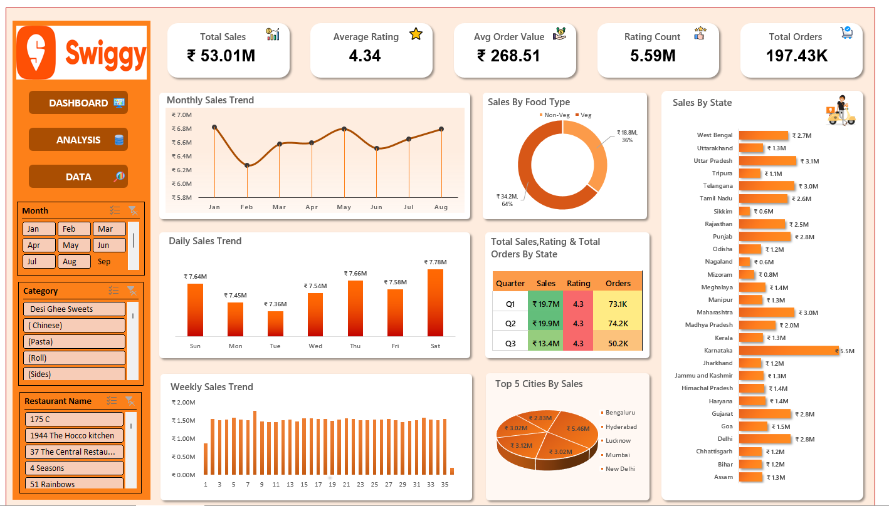

  

<h1 align="center">Swiggy Sales Dashboard | Excel Data Analytics</h1>

  
  
  

---

## 📌 Project Overview

The **Swiggy Sales Dashboard** is an interactive Excel-based analytics project designed to analyze food delivery data and generate business-ready insights.

This project demonstrates how Excel can be used as a Business Intelligence (BI) tool to track KPIs, identify trends, and support data-driven decision-making.

---

## 🎯 Project Objective

- Analyze sales performance and customer behavior  
- Track key business KPIs  
- Identify time-based and regional trends  
- Build a visually appealing and interactive dashboard using Excel  

---

## 📊 Key Performance Indicators (KPIs)

- **Total Sales** – Overall revenue generated from food orders  
- **Average Rating** – Customer satisfaction level across restaurants  
- **Average Order Value (AOV)** – Revenue per order  
- **Rating Count** – Total number of customer reviews  
- **Total Orders** – Number of food orders received  

---

## 📈 Dashboard Visualizations & Insights

- 📅 Monthly Sales Trend – Month-wise revenue analysis  
- 📆 Daily Sales Trend – Sales variation across days of the week  
- 🥗 Sales by Food Type (Veg / Non-Veg) – Revenue contribution comparison  
- 🗺️ Sales by State – State-wise revenue distribution  
- 📊 Quarterly Performance Summary – Sales, ratings, and orders by quarter  
- 🏙️ Top 5 Cities by Sales – Cities generating the highest revenue  
- 📉 Weekly Sales Trend – Identifies consistency and peak sales periods  

---

## 🧰 Tools & Skills Used

- Microsoft Excel  
- Pivot Tables & Pivot Charts  
- Slicers & Interactive Filters  
- KPI Cards  
- Conditional Formatting  
- Data Cleaning & Transformation  
- Dashboard Design & Data Storytelling  

---

## 🗂️ Repository Structure

📁 Swiggy_DashBoard_Excel  
├── Swiggy_Dashboard.xlsx  
├── DataSet.xlsx  
├── DashBoard_OutPut.png  
├── KPIS.txt  
└── README.md  

---

## 🖼️ Dashboard Preview

---

## 🚀 How to Use

1. Download or clone the repository  
2. Open Swiggy_Dashboard.xlsx in Microsoft Excel  
3. Enable Editing and Content  
4. Use slicers (Month, Category, Restaurant) to explore insights dynamically  

---

## 🎯 Key Business Insights

- Non-Veg food items contribute higher revenue  
- Metro cities dominate total sales  
- Weekends show higher order volumes  
- Customer ratings remain consistently strong across quarters  

---

## 👤 Author

**Ravi Teja**  
Aspiring Data Analyst  

🔗 GitHub: https://github.com/Raviteja0710  

---

⭐ If you found this project useful, don’t forget to star the repository!
